# Database & AI Knowledge Architecture

> **Prompt 2 of 15.** Complete data-layer design for the multilingual Government
> Scheme assistant. **Design only** — no SQL, no models, no migrations are
> implemented yet (`database/` scaffolding from Prompt 1 exists; code lands in
> later prompts).

## Scope

A normalized PostgreSQL model covering the full product: citizens and staff,
conversations, the government scheme knowledge base, extensible eligibility
rules, documents, service centres, multilingual content, search, an AI
Retrieval-Augmented Generation (RAG) knowledge base, and caches. The design maps
1:1 to the API contracts in `shared/src/domain/*.ts` and ships via the
`database/` Alembic pipeline.

## Design principles

1. **Extensibility over hardcoding.** Eligibility filters are data
   (`eligibility_filter_defs` + `eligibility_rules`), not code. Adding a filter
   (e.g. *"is a widow"*) is one row + a `CHECK`-independent value — zero code.
2. **All states, now and later.** `schemes` are `scope = central | state` with a
   `scheme_states` join; categories and languages are reference tables. New state
   or language = seed rows.
3. **Multilingual is a first-class layer.** `languages` (catalog) +
   `scheme_regional_languages` (which languages a scheme ships in) +
   `localized_texts` (EAV translations) with a canonical English snapshot on
   `schemes` for search.
4. **RAG-ready but not RAG-implemented.** `knowledge_sources` →
   `knowledge_chunks` → `embeddings` (pgvector) are architected; no vectors are
   stored or indexed yet.
5. **Auditable and update-friendly.** Content carries `status`,
   `verification_status`, `version`, and `content_hash`; every mutation is
   captured in `audit_logs`.

## Entity Relationship Diagram (conceptual → mermaid)

```mermaid
erDiagram
    users ||--o| user_profiles : has
    users ||--o{ chat_sessions : owns
    users |o--o{ notifications : gets
    users |o--o{ feedback : writes
    users |o--o{ user_saved_schemes : bookmarks
    users |o--o{ user_eligibility_results : evaluates
    users |o--o{ user_documents : uploads
    users ||--o| admin_users : staff
    admin_users |o--o{ audit_logs : performs
    chat_sessions ||--o{ chat_messages : contains

    languages }o--o{ scheme_regional_languages : "services"
    languages ||--o{ localized_texts : "localizes"

    schemes ||--o{ scheme_category_links : categorised
    scheme_categories ||--o{ scheme_category_links : "groups to"
    scheme_categories ||--o{ scheme_categories : parent
    schemes ||--o{ scheme_states : "applies in"
    states ||--o{ scheme_states : "covered"
    schemes ||--o{ scheme_tags : tagged
    schemes ||--o{ eligibility_rules : constrained
    eligibility_filter_defs ||--o{ eligibility_rules : "defines key"
    schemes ||--o{ scheme_benefits : offers
    schemes ||--o{ scheme_application_steps : steps
    schemes ||--o{ scheme_faqs : faqs
    schemes ||--o{ scheme_official_links : links
    schemes ||--o{ scheme_documents : requires
    schemes ||--o{ scheme_regional_languages : "locale"

    document_types ||--o{ scheme_documents : "classified as"
    document_types ||--o{ user_documents : "instances of"
    users ||--o{ user_documents : uploads

    states ||--o{ service_centres : located_in
    service_centres ||--o{ service_centre_services : offers
    states ||--o{ user_profiles : "resides in"

    schemes |o--o{ user_saved_schemes : bookmarked
    schemes |o--o{ user_eligibility_results : "eligibility of"
    schemes |o--o{ notifications : references
    chat_messages |o--o{ feedback : rates
    chat_messages ||--o{ citations : cites

    knowledge_sources ||--o{ knowledge_chunks : parsed_into
    knowledge_chunks |o--o{ embeddings : embedded_by
    embedding_models ||--o{ embeddings : encoded_by
```

## Document index

| # | Document | Covers |
| - | -------- | ------ |
| 01 | [Schema & table definitions](01-schema-tables.md) | All tables: columns, types, PK/FK, constraints, indexes |
| 02 | [Relationships & normalization](02-relationships-normalization.md) | FK graph, cardinality, normalization form, denormalization trade-offs |
| 03 | [Eligibility engine](03-eligibility-engine.md) | Extensible filter catalog + declarative rules |
| 04 | [Documents & service centres](04-documents-centres.md) | Document lifecycle, OCR-ready fields, CSC/e-Sevai geo data |
| 05 | [Multilingual strategy](05-multilingual.md) | Languages, localized_texts, fallback, future languages |
| 06 | [Search & index strategy](06-search-indexes.md) | Index catalogue + keyword/semantic/fuzzy/voice/regional search |
| 07 | [RAG knowledge base](07-rag-knowledge-base.md) | Sources → chunks → embeddings → retrieval → citations → sync |
| 08 | [Migrations, data update & scalability](08-migrations-data-update-scalability.md) | Migration lifecycle, ETL refresh, scale to states/users |

## Conventions (carried from Prompt 1)

- PostgreSQL **native enums** where value sets are stable; plain strings + `CHECK`
  where they evolve. Python enums mirror the closed sets.
- UUID (v7) primary keys for externally-referenced rows; `BIGINT identity` for
  the hot append-only tables (`chat_messages`, `user_eligibility_results`,
  `notifications`, `feedback`, `audit_logs`, `embeddings`, `citations`).
- Extensions enabled once at bootstrap: `citext`, `pg_trgm`, `postgis`,
  `vector`. `citext` for case-insensitive codes (scheme codes, tags, emails).
- Geography stored as WGS84 `lat/lng` doubles on the row plus a maintained
  `GEOGRAPHY(Point,4326)` for spatial queries — PostGIS GiST for "near me".
- Soft deletes via `status`/`deleted_at` on content and user tables; hard FKs
  with `ON DELETE` semantics documented in [02](02-relationships-normalization.md).
- **No PII in seeds.** Deterministic fake profiles only.